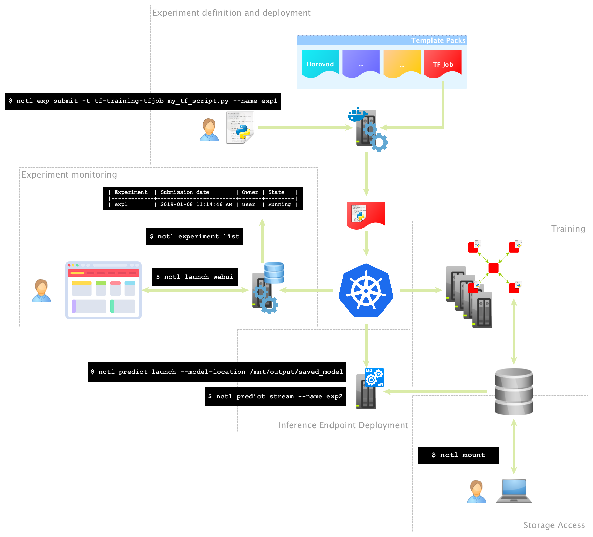

# Nauta

See the docs at: https://intelai.github.io/nauta/

The Nauta software provides a multi-user, distributed computing environment for running deep learning model training experiments. Results of experiments, can be viewed and monitored using a command line interface, web UI and/or TensorBoard*. You can use existing 
data sets, use your own data, or downloaded data from online sources, and create public or private folders to make collaboration 
among teams easier. 

Nauta runs using the industry leading Kubernetes* and Docker* platform for scalability and ease of management. 
Template packs for various DL frameworks and tooling are available (and customizable) on the platform to take the complexities out of creating and running single and multi-node 
deep learning training experiments without all the systems overhead and scripting needed with standard container environments.

To test your model, Nauta also supports both batch and streaming inference, all in a single platform.

To build Nauta installation package and run it smoothly on Google Cloud Platform please follow our [Nauta on Google Cloud Platform - Getting Started](toolbox/providers/gcp/gcp.md). More details on building Nauta artifacts can be found in [How to Build](docs/installation-and-configuration/How_to_Build_Nauta/HBN.md) guide.

To get things up and running quickly please take a look at our [Getting Started](docs/user-guide/actions/getting_started.md) guide.

For more in-depth information please refer to the following documents:

- [Nauta Installation and configuration guide](docs/installation-and-configuration/) 
- [Nauta User Guide](docs/user-guide/README.md)

# License

By contributing to the project software, you agree that your contributions will be licensed under the Apache 2.0 license that is included in the LICENSE file in the root directory of this source tree.
The user materials are licensed under [CC-BY-ND 4.0](https://creativecommons.org/licenses/by-nd/4.0/legalcode).

# Contact

Submit Github issue to ask a question, submit a request or report a bug.
