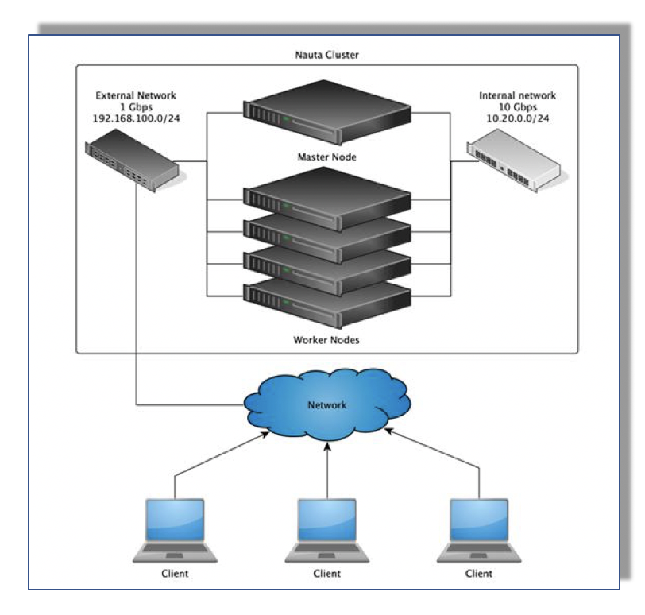

# Configuration File Tasks

This section discusses the following main topics: 

- [Configuration Overview](#configuration-overview)  
- [Configuration Considerations](#configuration-considerations)  
- [Example Configuration File](#example-configuration-file)  
- [YAML Configuration File Example](#yaml-configuration-file-example)
- [Default Value of an Empty Dictionary](#default-value-of-an-empty-dictionary)
- [Deciding to Leave the Proxy Parameter Empty](#deciding-to-leave-the-proxy-parameter-empty)
- [Docker Log Driver Settings](#docker-log-driver-settings)  
- [Network File System (NFS) Overview](#network-file-system-overview)
- [Redsocks Overview](#redsocks-overview)  
- [Networking Configuration Example Diagram](#networking-configuration-example)

## Configuration Overview

Nauta's configuration is specified by a _YAML Configuration file_. Nauta looks for this file at the location defined in the `ENV_CONFIG` environment variable (explained in the [Installation Process](../Installation_Process/IP.md), and in the example configuration file shown in the example configuration file below). This configuration file specifies network proxies, DNS server locations, and other Nauta related parameters listed below. For Inventory file information, refer to [Inventory File Example](../Inventory_Tasks/IT.md) for more information. 

### Parameter Color Indicators 

In the examples shown, _Green_ indicates a parameter name, and _Blue_ indicates an example parameter value. 

### Configuration Variables Indicators

Some configuration variables are of the _dictionary_ type, and for these: `{}` indicates an empty dictionary. Likewise, some variables are of the _list_ type, and for these: `[]` indicates an empty list.

## Configuration Considerations 

### Host Name Considerations

Host names _must_ conform to standard host naming rules and each element of the hostname _must_ be from 1 to 63 characters long. The entire host name, including the dots _must not_ exceed 253 characters long. Valid characters for host and domain names are ASCII(7) letters from a to z (lowercase), the digits from 0 to 9, and a hyphen. Furthermore, **_do not_** start a host and domain names with a **_hyphen_**. 

### Proxy Value Settings

All parameters present in the configuration file _must_ have values. Setting the configuration file with no value causes errors, for example, `proxy:`.

## Example Configuration File 

This is an _example_ file, containing dummy values for a few of the supported configuration values. For a complete list, refer to the section after the YAML file example below ([YAML File Example](#yaml-configuration-file-example)). For YAML file information, refer to [YAML Format Overview](https://en.wikipedia.org/wiki/YAML).

1. In the YAML file, the _list of items_ is a sequence of elements starting in a new line with a dash at the beginning. For example, an empty list: []. In an abbreviated form, elements can also be enclosed in a single line.

1.  In the YAML file, a dictionary is a sequence of pairs for the element's _key: value_. It can also be presented with each pair in a new line or abbreviated in a single line. 

## YAML Configuration File Example

Below is an example YAML file that provides examples of proxy settings, DNS server settings, Kubernetes, and so on. 
For detailed instructions on how to complete this, see the example  [Inventory File Example](../Inventory_Tasks/IT.md) and refer to the [Configuration File Example](../Configuration_Tasks_Variables/CTV.md) and refer to the [Installation Process](../Installation_Process/IP.md). 


```yaml
# Proxy Settings
proxy:
  http_proxy: http://<your proxy address and port>
  ftp_proxy: http://<your proxy address and port>
  https_proxy: http://<your proxy address and port>
  no_proxy: <localhost, any other addresses>, 10.0.0.1,localhost,.nauta

# This is a list of DNS servers used for resolution: a maximum of three entries.
dns_servers:
  - 8.8.8.8
  - 8.8.4.4

# This is a domain used as part of a domain search list.

dns_search_domains:
  - example.com

# This is place to define additional domain names for cluster to allow secure communication.
dns_names_for_certificate:
  DNS.7: "mycluster1.domain.name"
  DNS.8: "mycluster2.domain.name"

# This is the Internal domain name.
domain: nauta

# Internal subdomain for infrastructure.
nodes_domain: lab007

# This is the Internal Subdomain for Kubernetes resources.
k8s_domain: kubernetes

# This is the Network Range for Kubernetes pods.
kubernetes_pod_subnet: 10.3.0.0/16

# This is the Network Range for Kubernetes services.
kubernetes_svc_subnet: 10.4.0.0/16
```

## Default Value of an Empty Dictionary

For empty dictionaries, there are two defaults:

1. If a parameter _is not_ included in the configuration file, the default value is utilized. 

2. If a parameter is present in the configuration file with a default  value included, it appears as shown below. 

* `proxy: {}` 

## Deciding to Leave the Proxy Parameter Empty

There may be reasons to leave the proxy parameter set with an empty dictionary. Should you decide to do this, it may be for the following reasons: 

* You _do not_ need a proxy because you _do not_ have one in your network.

* You intentionally _do not_ want to use a proxy to connect your cluster as an external network to keep it isolated from the Internet.

## Configuration Variable Details

### proxy
- **Description:** These are the Proxy settings for internal applications. 
- **Default value:** {}

```yaml
proxy:
  http_proxy: http://<your proxy address and port>
  ftp_proxy: http://<your proxy address and port>
  https_proxy: http://<your proxy address and port>
  no_proxy: <localhost, any other addresses>, 10.0.0.1,localhost,.nauta
  HTTP_PROXY: http://:<your proxy address and port>
  FTP_PROXY: http://<your proxy address and port>
  HTTPS_PROXY: http://<your proxy address and port>
  NO_PROXY: .<localhost, any other addresses>, 10.0.0.1,localhost,.nauta
```
**Note:** Proxy addresses should be replaced by a specific value by a client.

### dns_servers
- **Description:** This is a list of DNS servers used for resolution: a maximum of three entries.
- **Default value:** []
```yaml
dns_servers:
  - 8.8.8.8
  - 8.8.4.4
```

### dns_names_for_certificate
- **Description:** This is a list of DNS names of the cluster.
The values from this parameter use acceptable addresses when accessing a cluster in securely.
Key values have to be in the format `DNS.X` where `X` is a number greater than 6 (internally allocated symbolic addresses).

- **Default value:** []

### dns_search_domains
- **Description:** This is a domain used as part of a domain search list.
- **Default value:** []

```yaml
dns_search_domains:
  - example.com
  ```

### domain
- **Description:** This is the _Internal_ domain name. This variable and _nodes_domain_ (defined below) together form the _full domain_ (`<nodes_domain>.<domain>`) for Nauta's internal domain. For example, if `domain` is _nauta_ and `sub_domain` is _infra_, the full domain is `infra.nauta`.
- **Default value:** nauta

```yaml
domain: nauta
```

### nodes_domain
- **Description:** This is the Internal subdomain for infrastructure. Full domain for an infrastructure is:
- **Default value:** infra

```yaml
nodes_domain: lab007
```

**Note:** These IP addresses _should not_ conflict with Internal IP address ranges.

### k8s_domain
- **Description:** This is the Internal subdomain for Kubernetes resources. The full domain for infrastructure is: `<k8s_domain>.<domain>`
- **Default value:** kubernetes

```yaml
k8s_domain: kubernetes
```

### elasticsearch
- **Description:** Password and username which will be set for authorized access
to elasticsearch. Authorized access allows usage of HTTP methods other than GET.
Changing these parameters is recommended.

- **Default value:** {admin_username: esadmin, admin_password: esadmin}

```yaml
elasticsearch:
  admin_username: esadmin
  admin_password: esadmin
```

### kubernetes_pod_subnet
- **Description:** This is the Network Range for Kubernetes pods. Kubernetes, by default, allocates `/24` pod CIDR block per node, so the size of `kubernetes_pod_subnet` must be big enough: e.g. for three node environment you will need at least `/22` CIDR subnet, as it allows to create 4 `/24` blocks within it (see for reference: https://kb.wisc.edu/ns/page.php?id=3493). In case of doubt, use the default mask size of `/16`.
- **Default value:** 10.3.0.0/16

```yaml
kubernetes_pod_subnet: 10.3.0.0/16
```

### kubernetes_svc_subnet
- **Description:** This is the Network Range for Kubernetes services. Mask size should be the same as in `kubernetes_pod_subnet` parameter.
- **Default value:** 10.4.0.0/16

```yaml
kubernetes_svc_subnet: 10.4.0.0/16
```

### apiserver_audit_log_maxage
- **Description:** This is the maximum age in days for Kubernetes apiserver audit logs.
- **Default value:** 7

```yaml
apiserver_audit_log_maxage: 7
```

### apiserver_audit_log_maxbackup
- **Description:** This is the maximum number of log files kept for Kubernetes apiserver audit.
- **Default value:** 10

```yaml
apiserver_audit_log_maxbackup: 10
```

### apiserver_audit_log_maxsize
- **Description:** The maximum audit log file size in MB.
- **Default value:** 1024

```yaml
apiserver_audit_log_maxsize: 1024
```

### insecure_registries 
- **Description:**  This is a list of insecure Docker registries added to configuration.
- **Default value:** []

```yaml
insecure_registries: 
- my.company.registry:9876
```
**Note:** This refers to Docker registries only. 

### enabled_plugins 
- **Description:** This is a list of enabled Yum plugins.
- **Default value:** []

```yaml
enabled_plugins:
  - presto
```

### disabled_plugins
- **Description:** This is a list of disabled Yum plugins.
- **Default value:** []

```yaml
disabled_plugins:
  - presto
```

### use_system_enabled_plugins
- **Description:** This defines if Yum should use system-enabled plugins.
- **Default value:** False

```yaml
use_system_enabled_plugins: False
```

### enabled_repos 
- **Description:** This is a list of enabled repositories, and is used for external dependencies installation.
- **Default value:** []

```yaml
enabled_repos:
  - rhel
```

### disabled_repos 
- **Description:** This is a list of disabled repositories, and is used for external dependencies installation.
- **Default value:** []

```yaml
disabled_repos:
  - rhel
```

### use_system_enabled_repos 
- **Description:** This defines if the default system repositories should be enabled in external dependencies installation.
- **Default value:** True

```yaml
use_system_enabled_repos: True
```

### input_nfs
- **Description:** Definition of the input NFS mounts for Samba. By default, internal NFS provisioner is used.
- **Default value:** {}
- **Fields**
    - **path:** NFS path to mount
    - **server:** NFS server

### output_nfs
- **Description:** Definition of the input NFS mounts for Samba. By default, internal NFS provisioner is used. By default, internal NFS provisioner is used. 
- **Default value:** {}

- **Fields**
    - **path:** NFS path to mount
    - **server:** NFS server
* **Note** For NFS information, see below. 

```yaml
nauta_extra_configuration:
  input_nfs:
    path: "{{ nfs_base_path }}/input"
    server: "{{ nfs_server }}"
  output_nfs:
    path: "{{ nfs_base_path }}/output"
    server: "{{ nfs_server }}"
```

## Docker Log Driver Settings

This is the Docker log driver settings for controlling rotation of a containers' logs on _bare metal environments_. In case of cloud deployments, such as Google Cloud Platform, instead of changing this parameter, refer to your cloud provider instructions for log rotation configuration. 

- Refer to [Docker Log Driver Settings](https://docs.docker.com/config/containers/logging/json-file) for more information. 

- **Default value:**
```yaml
docker_log_driver_settings:
  max_size: 5g
  max_file: 1
```
- **Fields**
    - **max_size:** Maximum size of log file
    - **max_file:** Maximum count of present log files

# Network File System Overview

The Network File System (NFS) allows a system to share directories and files with others over a network. The advantage of using NFS is that end-users, as well as programs can access files on remote systems in the same way as local files. In addition, NFS uses less disk space, as it can store data on a single machine while remaining accessible to others over a network.

## Optional Features: Redsocks and NFS Installation 

Either NFS or Redsocks is installed and configured during the installation process. By default, Redsocks _is not_ installed; however, NFS is installed by default. 

### Example NFS Configuration Settings 

```yaml
features:
  nfs: True
  redsocks: True
```
### Features List (NFS Default Settings)

- **NFS:** default: True
- **Redsocks:** default: False

# Redsocks Overview

Redsocks is a tool that allows you to redirect network traffic through a socket. For example: SOCKS4, SOCKS5 or HTTPs proxy server. Redsocks operates through a proxy server, and as a result it is referred to as a transparent proxy redirector.

- Refer to [How to transparently use a proxy with any application (Docker) using Iptables and Redsocks](https://medium.com/datadriveninvestor/how-to-transparently-use-a-proxy-with-any-application-docker-using-iptables-and-redsocks-b8301ddc4e1e) for more information. 

## Redsocks Configuration 

Redsocks configuration is an **optional** part of the installer; however, if you choose this option then configure Redsocks appropriately in your environment/organization.

Redsocks _is not_ enabled during the installation, as the default is set to _False_ (shown in the example below). Therefore, if you want to install Redsocks, you _must_ set the feature switch to **True**. 

**WARNING:** After the installation if you decide you want to install Redsocks, you will need to redo the entire installation to include Redsocks, and set the feature switch to True. It _**cannot**_ be changed to False in your configuration file after the initial install. Redsocks and NFS are independent of each other, so use judgment when initially setting these feature switches.

### How to Enable Features

Additional features can be enabled using features in the configuration, as shown below.

```yaml
features:
    redsocks: False
```

### Feature Plugin Configuration

```yaml
features:
  redsocks: True
features_config:
  redsocks:
    IP: 10.217.247.236
    Port: 1080
``` 

### Redsocks Configuration Parameters 

#### IP 
- **Description:** This is the IP address of Socks5 proxy.

```yaml
Required: True
```

#### Port 
- **Description:** This is the port address of Socks5 proxy. 

```yaml
Required: True
```

#### Interfaces 
- **Description:** Comma-separated list of interfaces from which traffic should be managed by RedSocks.

```yaml
Required: False
Default: cni0
```

# Networking Configuration Example

The Figure below shows an example Nauta Networking Diagram. While you can build a cluster with 1 machine to run all the examples, it is suggested to utilize at least 4 worker nodes (as shown in the example). The worker nodes should run Red Hat Enterprise Linux 7.6. All interfaces (both external and internal) are Ethernet interfaces. 



## Next Steps: Nauta Installation Requirements

* [Installation Requirements: Package Requirements](../Installation_Package_Requirements/IPR.md)

----------------------

## Return to Start of Document

* [README](../README.md)

----------------------
