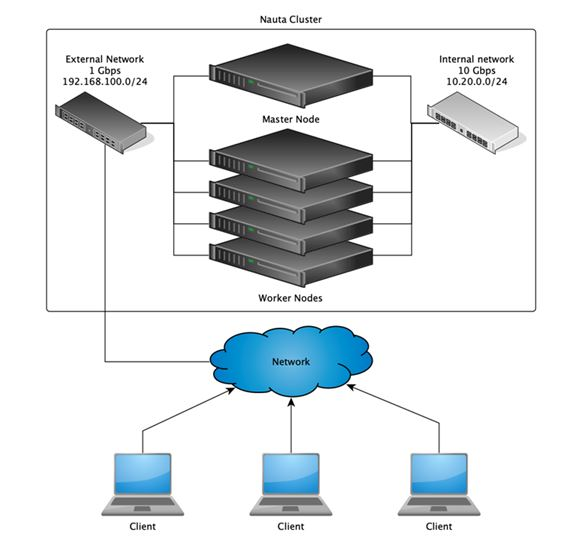

# Configuration Tasks
Nauta's configuration is specified by a YAML configuration file. Nauta will look for this file at the location defined the `ENV_CONFIG` environment variable (explained in [Installation Process](Installation_Process/IP.md)). This configration file specifies network proxies, DNS server locations, and other related values listed below.

**Note:** In the examples shown, Green indicates a parameter name, and Blue indicates an example parameter value. Some configuration variables are of type "dictionary" - for these, `{}` indicates an empty dictionary. Likewise, some variables are of type "list", and for these, `[]` indicates an empty list.

## Example Configuration File 
Note that this is an *example* file, containing dummy values for a few of the supported configuration values. For a complete list, refer to the section below the table.

```yaml
# Proxy Settings
proxy:
  http_proxy: http://<your proxy address and port>
  ftp_proxy: http://<your proxy address and port>
  https_proxy: http://<your proxy address and port>
  no_proxy: <localhost, any other addresses>, 10.0.0.1,localhost,.nauta

# This is a list of DNS servers used for resolution: a max of three entries.
dns_servers:
  - 10.102.60.20
  - 10.102.60.30

# This is a domain used as part of a domain search list.
dns_search_domains:
  - example.com

# This is the _Internal_ domain name.
domain: nauta

# Internal subdomain for infrastructure
nodes_domain: lab007

# This is the Internal subdomain for Kubernetes resources.
k8s_domain: kubernetes

# This is the Network Range for Kubernetes pods.
kubernetes_pod_subnet: 10.3.0.0/16

# This is the Network Range for Kubernetes services.
kubernetes_svc_subnet: 10.4.0.0/16
```
## Configuration Variable Details

### proxy
- **Description:** These are the Proxy settings for internal applications. 
- **Default value:** {}

```yaml
proxy:
  http_proxy: http://<your proxy address and port>
  ftp_proxy: http://<your proxy address and port>
  https_proxy: http://<your proxy address and port>
  no_proxy: <localhost, any other addresses>, 10.0.0.1,localhost,.nauta
  HTTP_PROXY: http://:<your proxy address and port>
  FTP_PROXY: http://<your proxy address and port>
  HTTPS_PROXY: http://<your proxy address and port>
  NO_PROXY: .<localhost, any other addresses>, 10.0.0.1,localhost,.nauta
```

### dns_servers
- **Description:** This is a list of DNS servers used for resolution: a max of three entries.
- **Default value:** []
```yaml
dns_servers:
  - 10.102.60.20
  - 10.102.60.30
```

### dns_search_domains
- **Description:** This is a domain used as part of a domain search list.
- **Default value:** []

```yaml
dns_search_domains:
  - example.com
  ```

### domain
- **Description:** This is the _Internal_ domain name. Note that this variable and 'nodes_domain' (defined below) together form the "full domain" (`<nodes_domain>.<domain>`) for Nauta's internal domain. For example, if `domain` is "nauta" and `sub_domain` is "infra", the full domain is `infra.nauta`.
- **Default value:** nauta

```yaml
domain: nauta
```

### nodes_domain
- **Description:** Internal subdomain for infrastructure. Full domain for an infrastructure is:
- **Default value:** infra

```yaml
nodes_domain: lab007
```

**Note:** These IP addresses _should not_ conflict with Internal IP address ranges. 

### k8s_domain
- **Description:** This is the Internal subdomain for Kubernetes resources. Full domain for infrastructure is: `<k8s_domain>.<domain>`
- **Default value:** kubernetes

```yaml
k8s_domain: kubernetes
```

### kubernetes_pod_subnet
- **Description:** This is the Network Range for Kubernetes pods.
- **Default value:** 10.3.0.0/16

```yaml
kubernetes_pod_subnet: 10.3.0.0/16
```

### kubernetes_svc_subnet
- **Description:** This is the Network Range for Kubernetes services.
- **Default value:** 10.4.0.0/16

```yaml
kubernetes_svc_subnet: 10.4.0.0/16
```

### insecure_registries 
- **Description:**  This is a list of insecure Docker registries added to configuration.
- **Default value:** []

```yaml
insecure_registries: 
- my.company.registry:9876
```
**Note:** This refers to Docker registries only. 

### enabled_plugins 
- **Description:** This is a list of enabled Yum* plugins.
- **Default value:** []

```yaml
enabled_plugins:
  - presto
```

### disabled_plugins
- **Description:** This is a list of disabled Yum plugins.
- **Default value:** []

```yaml
disabled_plugins:
  - presto
```

### use_system_enabled_plugins
- **Description:** This defines if Yum should use system-enabled plugins.
- **Default value:** False

```yaml
use_system_enabled_plugins: False
```

### enabled_repos 
- **Description:** This is a list of enabled repositories, and is used for external dependencies installation.
- **Default value:** []

```yaml
enabled_repos:
  - rhel
```

### disabled_repos 
- **Description:** This is a list of disabled repositories, and is used for external dependencies installation.
- **Default value:** []

```yaml
disabled_repos:
  - rhel
```

### use_system_enabled_repos 
- **Description:** This defines if the default system repositories should be enabled in external dependencies installation.
- **Default value:** True

```yaml
use_system_enabled_repos: True
```

### input_nfs
- **Description:** Definition of input NFS mounts for Samba. By default, internal NFS provisioner is used.
- **Default value:** {}
- **Fields**
    - **path:** NFS path to mount
    - **server:** NFS server

### output_nfs
- **Description:** Definition of input NFS mounts for Samba. By default, internal NFS provisioner is used. By default, internal NFS provisioner is used.
- **Default value:** {}

- **Fields**
    - **path:** NFS path to mount
    - **server:** NFS server

```yaml
nauta_configuration:
  input_nfs:
    path: "{{ nfs_base_path }}/input"
    server: "{{ nfs_server }}"
  output_nfs:
    path: "{{ nfs_base_path }}/output"
    server: "{{ nfs_server }}"
```

### Optional Features: Redsocks and NFS 

Either Redsocks or NFS is installed and configured during the installation process. By default, Redsocks is not installed; however, NFS is installed by default.   

This is a map of enabled features. Redsocks is not enabled during the installation, as the default is set to false (shown in the example below). Therefore, if you want to install Redsocks you need to set the feature switch to True. 
Caution: After the installation should you decide you want to install Redsocks, you will need to redo the entire installation to include Redsocks and set the feature switch to True. It cannot be changed to False in your config file after the initial install.  Redsocks and NFS are independent of each other, so use judgment when initially setting these feature switches.

```yaml
features:
  nfs: True
  redsocks: True
```

## Features: Network File System (NFS) and Redsocks 
Nauta features include NFS and Redsocks*.  To configure either NFS or Redsocks, you must enable either feature and configure feature options. 

## Network File System Overview
The Network File System, or NFS allows a system to share directories and files with others over a network. The advantage of using NFS is that end-users as well as programs can access files on remote systems in the same way as local files. In addition, NFS uses less disk space, as it can store data on a single machine while remaining accessible to others over a network.

## Redsocks Configuration 
Redsocks configuration is an optional part of the installer; therefore, it might apply only to limited number of installations.

### Features List 
- **NFS:** default: True
- **Redsocks:** default: disabled

### How to Enable Features 
Additional features can be enabled using features object in configuration, as shown below.

```yaml
features:
    redsocks: False
```

### Feature Plugin Configuration 
Configuration for features should be placed under `features_config`.

```yaml
features:
  redsocks: True
features_config:
  redsocks:
    IP: 10.217.247.236
    Port: 1080
``` 

### Redsocks Configuration Parameters 

#### IP 
- **Description:** This is the IP address of Socks5 proxy.

```yaml
Required: True
```

#### Port 
- **Description:** This is the port address of Socks5 proxy. 

```yaml
Required: True
```

#### Interfaces 
- **Description:** Comma-separated list of interfaces from which traffic should be managed by RedSocks.

```yaml
Required: False
Default: cni0
```

## Networking Configuration Example
The Figure below shows an example Nauta Networking Diagram. While you can build a cluster with 1 machine to run all the examples it is suggested to utilize at least 4 worker nodes (as shown in the example). The worker nodes should run Red Hat Enterprise Linux 7.5. All interfaces (both external and internal) are Ethernet interfaces. 



## Next Steps: Nauta Installation Requirements

* [Installation Requirements: Package Requirements](../Installation_Package_Requirements/IPR.md)


