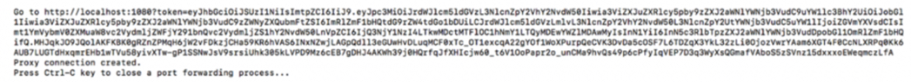

# Launching the Web UI
Do the following to launch the Web UI:
1. Use the following command:
    *	**Execute:** `dlsctl launch webui --port 1080` 
    
**Note:** The port shown is an example only. As a result, your requirements may differ from the shown example. 

The following result displays.

2.	Copy the URL returned by the command (as above) to a web browser to launch Web UI on a local machine.

The Web UI displays.

