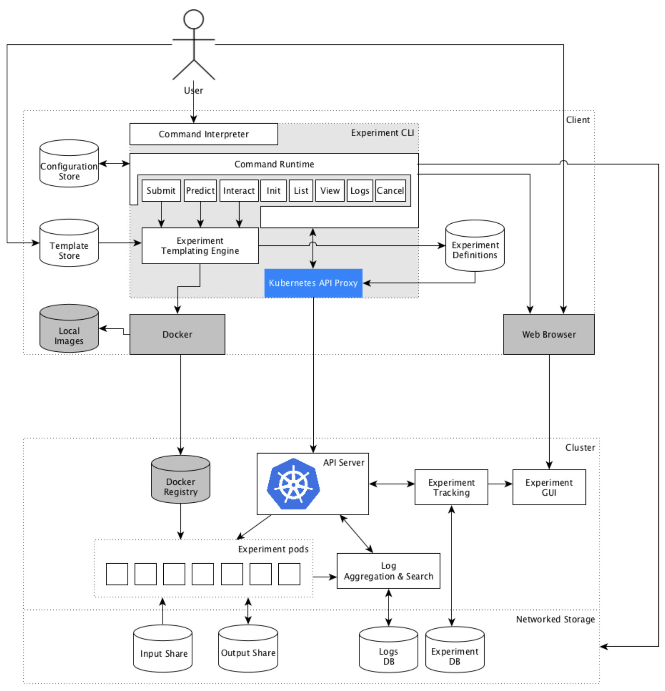

# Nauta for Enterprise

This Nauta installation guide provides an overview of the requirements, general installation requirements, as well as the installation process, and inventory and configuration tasks to set up a test environment. However, you may have additional networking, configuration management, or operating system requirements, in which case consult with your IT department guidelines. 

The figure below shows an example of the Nauta System Architecture Diagram. 

