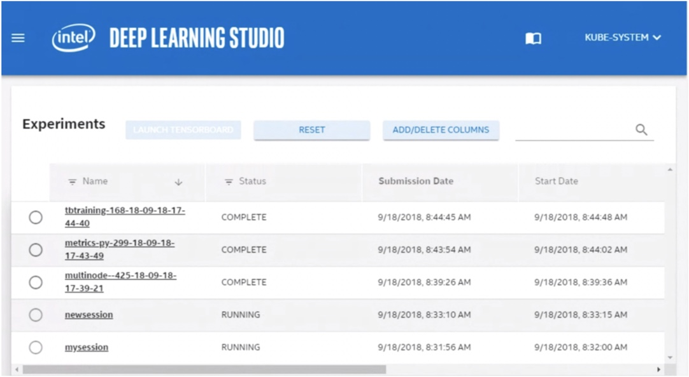

# User Management (UNDER CONSTRUCTION) 

## Create a User Account

Creating a new user account creates a user account configuration file with _kubectl configuration_ files. 

### Setting up an Administrator Account

Before creating administrator accounts, you need to complete the following steps:

1. Install nctl, based on your IT requirements.
   - **Note:** Refer to the Nauta User Guide for more information.
   
2. Copy the `nauta-admin.config` file to the machine where nauta resides. Place this configuration file in the `<PATH>` that meets your requirements.  

3. Set up `KUBECONFIG` variable to point to the full path of 'nauta-admin.config' to where you copied the file in step 2. Follow the instructions below (Creating a User) to create users.

`KUBECONFIG=<PATH>/nauta-admin.config`

## Creating a User

The following is used to create a Nauta user, _not_ an Administrator. In addition, a user _does not_ have SSH access to the servers. You _must_ be an Administrator to complete this task. To create a user, perform these steps. 

1. The Nauta user create command sets up a namespace and associated roles for the named user on the cluster. It sets up home directories, named after the username, on the input and output network shares with file-system level access privileges. To create a user:
 
   `$ nctl user create <username>`

2. This command also creates a configuration file named: '<username>.config' and places this file in the user's home directory. To verify that your new user has been created.

   `nauta user list`

3. This lists all users, including the new user just added, but _does not_ show Administrators. An example is shown below. 

4. As an Administrator, you need to provide '<username>.config' file to the Nauta user. The user can save this file to an appropriate location of their choosing; for example, their home directory using the following command:
   
   `cp <username>.config ~/`

5. Use the export command to set this variable for the user:

   `export KUBECONFIG=~/<username>.config`

### Limitations

Users with the same name _cannot_ be created directly after being removed. In addtion, user names are limited to a 32 character maximum, must be lowercase, no underscores, periods, or special characters, and _must_ start with a letter not a number. You can use a hyphen to join user names, for example: john-doe (see [Troubleshooting](Z_examples/Troubleshooting) for more details). 

## Delete a User Account

Only an Administrator can delete user accounts and deleting a user removes that user's account from the Nauta software; therefore, that user _will not_ be able to log in to the system. This will halt and remove all experiments and pods; however, all artifacts related to that user's account, such as the users input and output folders and all data related to past experiments they have submitted remains. 

To remove a user:

 `nctl user delete <user_name>`

This command asks for confirmation. 

**Do you want to continue? [y/N]:** press y to confirm deletion.

The command may take up to 30 seconds to delete the user and you may receive the message: User is still being deleted. Check the status of the user in a while. Recheck, as desired.

## Purging

To permanently remove (purge) all artifacts associated with the user and all data related to past experiments submitted by that user: 

`dlsctl user delete <user_name> -p/--purge`
      
### Limitations	
The nauta user delete command may take up to 30 seconds to delete the user. A new user with the same user name _cannot_ be created until after the delete command confirms that the first user with the same name has been deleted (see: [Troubleshooting](Z_examples/Troubleshooting) for more details).

## Launching the Web UI 

To review the Resources Dashboard, launch the Web UI from the Command Line Interface (CLI).

Do the following to launch the Web UI:

1. Use the following command:

`nctl launch webui` 
    
**Note:** The port shown is an example only.  

2. The Web UI displays. For Administrators, the Web UI displays empty an list experiments and shows the following message:

`No data for currently signed user. Click here to load all users data.`

3.	Your default web browser opens and disclays the Web UI.

The images shows the Nauta Web UI. This UI contains experiment information that can be sorted by name, status, and various dates.

