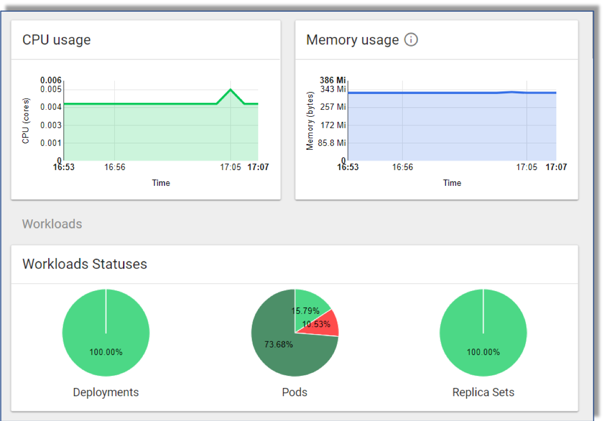

# Kubernetes Resource Dashboard Overview

Kubernetes provides a way to manage containerized workloads and services, to manage resources given to a particular experiment and monitor workload statuses and resource consumption. Refer to [Kubernetes Web UI (Dashboard)](https://kubernetes.io/docs/tasks/access-application-cluster/web-ui-dashboard) for detailed Kubernetes information. 

To access Kubernetes:

1. Click the **Hamburger Menu**  at the far left of the UI to open a left frame.

2. Click the **Resources Dashboard** to open the Kubernetes resources dashboard in a separate browser tab.

An example Kubernetes Dashboard is shown below.

## Return to Start of Document

----------------------
* [README](../README.md)

----------------------

