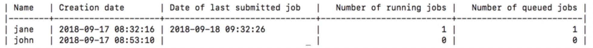

# Creating a User Account

<<<<<<< 7e1b93e99f0305f1e24c9c6e651e0aaed43adca8
Only an Administrator _can create_ a user account.
=======
The user is the data scientist who wants to perform deep learning experiments to train models that will, after training and testing, be deployed in the field. 
>>>>>>> Reconciling Branches

The user has full control (list/read/create/terminate) over their own experiments and has read access (list/read) of experiments belonging to other users on this cluster. Creating a new user account creates a user account configuration file compliant in format with kubectl configuration files.

**Note:** Only an Administrator _can create_ a user account. 

## Limitations

Users with the same name _cannot_ be created directly after being removed. This is due to a user's related Kubernetes objects that are deleted asynchronously by Kubernetes and this can take some time. Consider waiting thirty minutes before creating a user with the same name; the same name as the user just deleted.

In addition, user names are limited to a 32-character maximum and there are no special characters except for hyphens. However, all names _must_ start with a letter, _not_ a number. You can use a hyphen to join user names, for example: john-doe.

### Create the User

To create a user, execute the following steps:

1. The `nctl user create <username>`  command sets up a namespace and associated roles for the named user on the cluster. It sets up _home_ directories, named after the username, on the _input_ and _output_ network shares with file-system level access privileges. Create the user:
 
    `$ nctl user create <username>`

2. The above command also creates a configuration file named `<username>.config` that the admininstrator provides to the user. The user then copies that file into a local folder. 

3. Use the following command to copy the file into your local folder:

    `$ cp <username>.config ~/<local_user_folder>/.`

4. Use the `export` command to set this variable for the user:
 
    `$ export KUBECONFIG=~/<local_user_folder>/<username>.config`

5. Verify that the new user has been created with the following command:

   `$ nctl user list`

As shown in the image below, all users are listed, including the new user just added.

