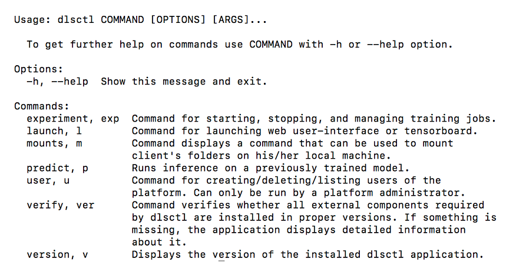

# Getting Started

This section provides brief examples for performing some of the most essential and valuable 
tasks supported by Intel® DL Studio software. 

**Note:** Several commands in this section require access to the internet to download data, scripts, etc.

The section discusses the following topics:

* Verifying Installation
* Overview of dlsctl Commands
* Example Experiment
* Adding Metrics with the Metrics API (Optional) 
* Launch TensorBoard*
* Viewing Experiment Output Folder
* Removing Experiments (Optional) 

## Verifying Installation

Check that the required software packages are available in terminal by PATH and verified that correct version is used.

**Note 1**: Docker* can contain kubectl* binary in a version that is not supported. Please verify that the PATH environment variable has the correct order of paths and that the kubectl from docker package is not used.<br>
**Note 2**: If you are behind a proxy, remember to set http_proxy, https_proxy and no_proxy environment variables.

Enter the following command to verify your installation. 
* Execute: `dlsctl verify`

If any installation issues are found, the command returns information about their cause (which application should be installed and in which version). This command also checks if the CLI can connect to Intel DL Studio and if port forwarding to Intel DL Studio is working properly. 
 If no issues are found, a message indicates checks were successful.  Following are example results of this command:
 


## Overview of dlsctl Commands

Each dlsctl command has at least two options:

* `-v, --verbose` - Set verbosity level:
  * `-v` for INFO - Basic logs on INFO/EXCEPTION/ERROR levels are displayed.
  * `-vv` for DEBUG - Detailed logs on INFO/DEBUG/EXCEPTION/ERROR levels are displayed.
* `-h, --help` - The application displays the usage and options available for a specific command or subcommand.
 
Access help for any command with the `-help` or `-h` parameter. The following command provides a list and brief description of all dlsctl commands. 

**Execute**: `dlsctl -help`
The results are shown below.

 


## Example Experiment

The Intel DL Studio installation  contains an `example` folder at the root. All scripts used in this User Guide can be found in that folder. The Intel DL Studio installation includes sample training scripts and utility scripts that can be run to demonstrate how to use Intel DL Studio.  This section describes how to use these scripts. 

### Examples Folder Content

The examples folder in the dlsctl installation contains these following experiment scripts:
* `mnist_single_node.py` - training of digit classifier in single node setting
* `mnist_multinode.py` - training of digit classifier in distributed TensorFlow setting
* `mnist_horovod.py` - training of digit classifier in Horovod

There are also the following two utility scripts, `mnist_converter_pb.py` and  `mnist_checker.py`, which are related to inference process and model verification.

**Note**: Experiment scripts must be written in Python.  

### Launch Training Using the Scripts

Launching training in Intel DL Studio is performed with the following command:

`dlsctl experiment submit -t template SCRIPT_LOCATION`

with:
* `template` = `tf-training-tfjob` and `SCRIPT_LOCATION` = `examples/mnist_single_node.py` (relative to dlsctl
root) for single node training. The template parameter in this case is optional.
* or `template` = `multinode-tf-training-tfjob` and `SCRIPT_LOCATION` = `examples/mnist_multinode.py` for multinode
training,
* or `template` = `multinode-tf-training-horovod` and `SCRIPT_LOCATION` = `examples/mnist_horovod.py` for Horovod
training.

### Submitting an Experiment

**Note**: All examples assume macOS. Any line-wraps below are not intended.  
**Note**: The included example scripts do not require external data source. They download the MNIST dataset and save it locally. Templates referenced here have some set CPU and Memory requirements. Please refer to template packs documentation for more info about changing those if you want to.<br>
**Note**: For more info about experiment submit command please refer to [experiment Command](experiment.md).

This example will show how to submit a mnist experiment and write the TensorBoard data to a folder in your DL Studio output folder. Enter the following command from DLSCTL_HOME’s examples folder (assuming the application is not added to your terminal PATH):

**Syntax**:
`dlsctl experiment submit [options] SCRIPT_LOCATON [-- script_parameters]`

**Execute**: 
`dlsctl experiment submit -t tf-training-tfjob examples/mnist_single_node.py --name single`

**Where**:
* `-t`,  TEXT: Name of a template that will be used by Intel DL Studio to create a description of a job to be submitted.
* `-- SCRIPT_LOCATION`: The path and name of the Python script use to perform this experiment.

**Note**: In order to run TensorBoard, TensorBoard data must be written to a folder in the directory `/mnt/output/experiment`. This example script takes care of this requirement, but your scripts will need to do this well.

#### Result of this Command

The execution of the submit command may take a few minutes the first time. During this time, resources are allocated, the experiment package is created using parameters, scripts, and settings, a docker image is built then pushed to the Kubernetes cluster. When the experiment submission is complete, the following result is displayed:

  

#### Viewing Experiment Status

Use the following command to view the status of all your experiments:

**Syntax**: `dlsctl experiment list [options]`

**Execute**: `dlsctl experiment list --brief`

Experiment status displays as below.  This is an example only. The `--brief` option returns a short version of results as shown.

  
 
### Monitoring Training
 There are three ways to monitor training in Intel Dl Studio, all which are discussed in the following sections. 
 
* View Experiment Log
* Adding Experiment Metrics
* Launching Tensorboard


### View Experiment Log 

Use the following command to view the experiment log.

**Syntax**: `dlsctl experiment logs [options] EXPERIMENT_NAME`

**Execute**: `dlsctl experiment logs mnist-tb`

A log displays as follows. _The result below is an example only._

   

## Adding Metrics with the Metrics (Optional)

Experiments launched in Intel DL Studio can output experiment metrics using the `publish` function from the experiment metrics api. To see an example of metrics published with the `single` experiment executed in the above example, enter this command: <br>
**Execute**: `dlsctl experiment list`

Following are example results (only a fragment is shown):

 

To add metrics to an experiment file you have created, you need to edit the experiment file to use the experiment_metrics.api  and then publish the accuracy in your experiment file. 

1.	Add the metrics library API with the following entry:
   `from experiment_metrics.api import publish`

2.	Add metrics for publishing  the last step's accuracy by adding this code in the ‘def feed_dict’ definition after the for loops: 
```
       metrics = {}
       metrics["accuracy_step_{}".format(i)] = str(acc)
       publish(metrics)
```
3.	Save the changes.

4.	Submit the experiment again, but with a different name. 
      
5.	The published metrics can now be viewed. 

       **Execute**: `dlsctl <new_name> experiment list`

**Information about saving metrics for multinode experiments**

Storing at the same time two (or more) metrics with the same key from two different nodes may lead to errors (such as
loosing some logs) due to conflicting names. To avoid this, adding metrics for multinode experiments should be done using one of the two following methods:
1. The key of a certain metric should contain also a unique identificator of a node from which this metric comes. Creation
of such identicator can be done in the following ways:
    * For horovod multinode training jobs, result of the `rank()` function provided by the `horovod` package can be used
    as a node's identificator.  
    * For `tfjob` multinode training jobs, a user can take all necessary info from the TF_CONFIG environment variable. Here is
an example piece of a code creating such identificator:
```

tf_config = os.environ.get('TF_CONFIG')
if not tf_config:
    raise RuntimeError('TF_CONFIG not set!')

tf_config_json = json.loads(tf_config)

job_name = tf_config_json.get('task', {}).get('type')
task_index = tf_config_json.get('task', {}).get('index')

# final node identificator
node_id = '-'.join(job_name,task_index) 

``` 
2. Only one node should store metrics. Deciding which node should store metrics can be done in the following ways:  
      * For horovod multinode training jobs, the `horovod` python library provides the `rank()` function that returns a number
of a current worker. Master is marked with the number 0, so only a pod with this number should store logs.
      * For `tfjob` multinode training jobs, because there is no dedicated master node, a user should choose which worker should
be responsible for storing metrics. The identificator of a current worker can be obtained as described in method 1 above. A user
should choose one of such identificators and store logs only from a node having this chosen id. 
   

## Launching TensorBoard

Generally, every file that the training script outputs to `/mnt/output/experiment` (accessed from the perspective of training script launched in Intel DL Studio) is accessible from the outside after mounting the output directory with command provided by `dlsctl mount`. 
Use the following command to launch TensorBoard and to view graphs of this model's results. (Refer to [Working with Datasets](working_with_datasets.md) for more information.) 

When training scripts output Tensorflow summaries to `/mnt/output/experiment`, they can be automatically picked up by Tensorboard instance launched with command:

**Syntax**: dlsctl launch tensorboard [options] EXPERIMENT_NAME

**Execute**: `dlsctl launch tensorboard single`

The following message displays:

  
 
The following figure shows the browser display of TensorBoard dashboard with the experiment’s results.

 
 
## Inference

To perform inference testing (using predict batch command in this example) you need to:

1.	Prepare data for model input.
2.	Acquire a trained model.
3.	Run prediction instance with trained model on this data.

### Data preparation
The example `mnist_converter_pb.py` script located in the `examples` folder can be used for data preparation. This script prepares the sample of MNIST test set and converts it to `protobuf` requests acceptable by the served model. This script is run locally and requires `tensorflow`, `numpy`, and `tensorflow_serving` modules. The `mnist_converter_pb.py` script takes two input parameters:

* `--work_dir` which defaults to `/tmp/mnist_test`. It is a path to directory used as `workdir` by this script and `mnist_checker.py`. Downloaded MNIST dataset will be stored there as well as converted test set sample and labels cached for them.

* `--num_tests` which defaults to 100. It is a number of examples from test set which will be converted. Max value is 10000

Running:
`python examples/mnist_converter_pb.py`

will create `/tmp/mnist_test/conversion_out folder`, fill it with 100 `protobuf` requests, and cache labels for these requests in `/tmp/mnist_test/labels.npy` file.

### Trained Model

Servable models (as with other training artifacts) can be saved by a training script. As previously mentioned, to access these you have to use the command provided by the `dlsctl mount` command and mount output storage locally. Example scripts all save servable models in their models subdirectory. To use models like this for inference, you will have to mount input storage too, because models have to be accessible from inside of the cluster. 

For the single experiment example, execute these commands:
```
mkdir /mnt/input
mkdir /mnt/input/single
mkdir /mnt/output
... mount command provided with dlsctl mount used to mount output storage to /mnt/output
... mount command provided with dlsctl mount used to mount input storage to /mnt/input
cp /mnt/output/single/models/* -Rf /mnt/input/single/
```
After these steps /mnt/input/single should contain:
```
/mnt/input/single/:
00001
/mnt/input/single/00001:
saved_model.pb  variables
/mnt/input/single/00001/variables:
variables.data-00000-of-00001  variables.index
```
### Running Prediction Instance
The following provides a brief example of running inference using the batch command. For more information, refer to [Evaluating Experiments with Inference Testing](inference_testing.md)

Before running the `batch` command, you need to copy `protobuf` requests to input storage, because  they need to be accessed by the prediction instance too. 

**Execute** these commands:
```
mkdir /mnt/input/data
cp /tmp/mnist_test/conversion_out/* /mnt/input/data
```
The next command will create a prediction instance.<br>
**Execute**:
`dlsctl predict batch -m /mnt/input/home/single -d /mnt/input/home/data --model-name mnist --name single-predict`

Following are the example results of this command: 


**Note**: Notice the additional home directory in path to both model and input data. This is how the path looks from the perspective of the prediction instance.<br>
**Note**: `mnist_converter_pb.py` creates requests to the mnist model. Note that `--model-name mnist` is where this mnist name is given to the prediction instance.<br>
**Note**: For more info about predict command, please refer to [predict Command](predict.md) 

After the prediction instance completes (can be checked using the `predict list` command), you can collect instance responses from output storage. In our example, it would contain 100 `protobuf` responses. These can be validated in our case using `mnist_checker.py`. 

Running the following command locally:<br>
`python examples/mnist_checker.py --input_dir /mnt/output/single-predict` <br>
will display the error rate calculated for this model and this sample of the test set.
 
## Viewing Experiment Output Folder

Use the following steps to mount the output folder and view TensorBoard data files.

1.	macOS/Ubuntu: Mount a folder to your DLS4E namespace output directory. Create a folder for mounting named `my_output_folder`. 

       **Execute**: `mkdir my_output_folder`

2.	To see the correct mount options and command:

       **Execute**: `dlsctl mount`

3.	Use the mounting command that was displayed to mount Intel DL Studio storage to your local machine. Following are examples of mounting the local folder to the Intel DL Studio output folder for each OS:
       * MacOS: `mount_mbfs //'USERNAME:PASSWORD'@CLUSTER-URL/output my_output_folder`
       * Ubuntu: `sudo mount.cifs -o username=USERNAME,password=PASSWORD,rw,uid=1000 \ //CLUSTER-URL/output my_output_folder`
       * Windows:  Use Y: drive as mount point. `net case Y: \\CLUSTER-URL\output /user:USERNAME PASSWORD`

4.	Navigate to the mounted location. 
       * MacOS/Ubuntu only: Navigate to my_output_folder
       * Windows only: Open Explorer Window and navigate to Y: drive.

5.	See the saved event file by navigating to the output folder. 
6.	Unmount DLS Storage using one of the below commands:
       * MacOS: `umount output my_output_folder`
       * Ubuntu: `sudo umount my_output_folder`
       * Windows: `Eject or net use Y: /delete`
       
For more information on mounting, refer to [Working with Datasets](working_with_datasets.md).

## Removing Experiments (Optional) 
An experiment that has been completed and is no longer needed can be removed from the experiment list using the cancel command and its purge option. The experiment will only be removed from the experiment list. The experiment’s artifacts will remain in the Intel DL Studio storage output folder. Logs will be removed.

**Syntax**: `dlsctl experiment cancel [options] EXPERIMENT_NAME`

**Execute**: `dlsctl experiment cancel –-purge <your_experiment>


