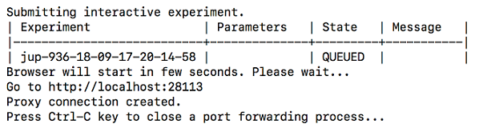

# Launching Jupyter* Interactive Notebook

You can use Jupyter* Notebook to run and display the results of you experiments. This release of Nauta supports Python 3 and 2.7 for scripts. Launch Jupyter Notebook using the following command:

**Syntax:** `nctl experiment interact [options]`

Options, include:
* `name` - The name of this Jupyter Notebook session. 

* `filename` - File with a notebook that should be opened in Jupyter notebook.

For detailed command syntax information, refer to: [experiment interact Subcommand](experiment.md#interact-Subcommand)

Enter this command to launch Jupyter:

`nctl experiment interact`

## Storage and Session Data

Files located in the input storage are accessible through Jupyter Notebooks. Only files that are written to `/output/home/` are persistently stored. Therefore, changes made to other files, including model scripts, during the session _will not_ be saved after the session is closed. Therefore, it is recommended that you save session data to the `output/<experiment>` folder for future use.

**Note:** Files that are accessible through the Jupyter Notebook are the same folders accessible to the user for experiments.

## Tunneling

If you are using CLI through remote access, you will need to setup a X server for tunneling over SSH with port forwarding or use SSH Proxy command tunneling. After establishing a tunnel from the gateway to your local machine, you can use the URL provided by nctl.

The following result displays.

 
  
Jupyter Notebook will launch in your default web browser. The following displays. 

 

An example active Jupyter Notebook, shows a simple experiment plot.
 
 
 
 ## Canceling a Jupyter Notebook

In Nauta, running a Jupyter notebook is done through an interact session. The session will remain open such that the Jupyter notebook that is running will continue when the browser is closed. Therefore, a user _must_ manually cancel the interact session, or it will continue to allocate resources.
 
### Steps to Manage and Cancel Interacts:

1. See all running jobs, execute: nctl experiment list --status RUNNING

2. To cancel a running interact, execute: nctl experiment cancel [options] [EXPERIMENT_NAME]

   * EXPERIMENT_NAME is the interact name
   * The --purge option should be used if user wishes to remove session from experiment list
   
To verify that cancellation has completed, execute: nctl experiment list --status RUNNING 
 
 
 
