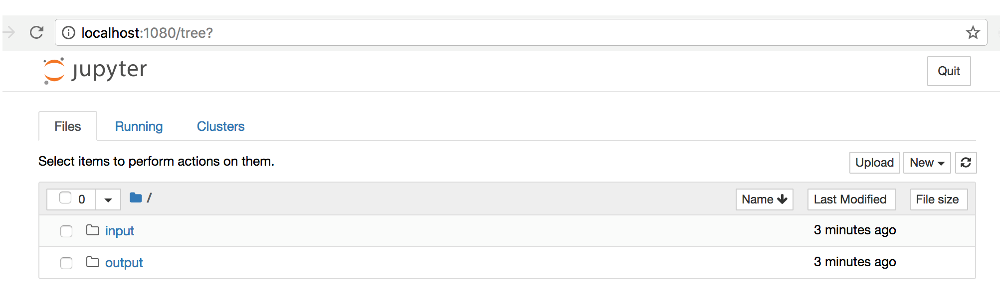

# Launching Jupyter Interactive Notebook


Use the Jupyter Notebook to run and display the results of your experiments. This section discusses the following main topics:

 - [Launching Jupyter Interactive Notebook Instructions](#launching-jupyter-interactive-notebook-instructions)
 - [Tunneling](#tunneling)
 - [Canceling a Jupyter Notebook](#canceling-a-jupyter-notebook)

## Launching Jupyter Interactive Notebook Instructions

This release of Nauta supports Python 3 and 2.7 for scripts. 

**Syntax:** `nctl experiment interact [options]`

Options, include:

* `name` - The name of this Jupyter Notebook session. 

* `filename` - File with a notebook or a Python script that should be opened in Jupyter notebook.

For detailed command syntax information, refer to: [experiment interact Subcommand](experiment.md#interact-subcommand)

Execute this command to launch Jupyter:

`nctl experiment interact`

## Tunneling

If you are using CLI through remote access, you will need to setup an X server for tunneling over SSH with port forwarding or use SSH Proxy command tunneling. After establishing a tunnel from the gateway to your local machine, use the URL provided by nctl. The following result displays.

```
Submitting experiments.
| Experiment                  | Parameters | State  | Message   |
|-----------------------------+------------+--------+-----------|
| jup-936-18-09-17-20-14-58   |            | QUEUED |           | 

Browser will start in a few seconds. Please wait...
Go to http://locahost:28113
Proxy connection created.
Press Ctrl-C key to close a port forwarding process...
```
  
An example Jupyter Notebook (shown below) launches in your default web browser. 

 

## Canceling a Jupyter Notebook

In Nauta, running a Jupyter notebook is performed through an interact session. The session remains open and continues to run in your browser until closed Therefore, you _must_ manually cancel the interact session, or it will continue to use/allocate resources.
 
### Steps to Manage and Cancel Interacts

1. To see all running jobs, execute: `nctl experiment list --status RUNNING`

2. To cancel a running interact, execute: `nctl experiment cancel [options] [EXPERIMENT-NAME]`

   * `EXPERIMENT-NAME` is the interact session name.
   
   * Use the `--purge` option if you need to remove session from experiment list. For _purge_ information, refer to: [Getting Started, Remove Experiment Section](../actions/getting_started.md). 
   
3. To verify that cancellation has completed, execute: `nctl experiment list --status RUNNING` 

----------------------

## Return to Start of Document

* [README](../README.md)

----------------------
