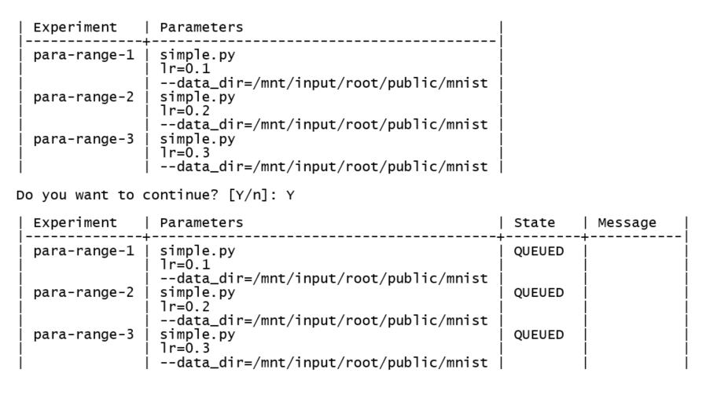

# Submitting Multiple Experiments

This section describes how to launch multiple experiments using the same script.

As of this release your experiment script must be written in Python. Storage locations for your input and output folders are determined by the mount command. See [Mounting Storage to View Experiment Output](mount_exp_output.md) and [Mounting Experiment Input to Storage](mount_exp_input.md).

To submit multiple individual experiments that use the same script, use the following command syntax (line wrap is not intended).

**Syntax:** `dlsctl exp submit –parameter_range SCRIPT_NAME [-- SCRIPT_PARAMETERS]`

**Note:** `SCRIPT_NAME` above refers to values (set or of a range) of a single parameter.

**Execute:** `dlsctl experiment submit –parameter_range lr "{0.1, 0.2, 0.3}" <script.py> -- --data_dir=/mnt/input/root/public/<dataFolder>`

Parameters can include either:

* *parameter-range* argument that defines the name of a parameter together with its values expressed as either a range or an explicit set of values, or

* *parameter-sets* argument that specifies a number of distinct combinations of parameter values.

An example of this command using `parameter_range` is shown below (line wrap is not intended).

`dlsctl experiment submit --name para-range --parameter_range lr "{0.1, 0.2, 0.3}" simple.py -- --data_dir=/mnt/input/root/public/mnist`

The following result displays.
 

**Note:** Your script must be written to process your input data as it is presented, or conversely, your data must be formatted to be processed by your script. No specific data requirements are made by the Intel DL Studio software.
