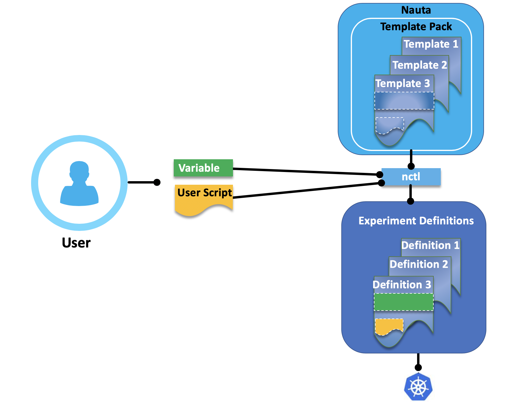

# Working with Template Packs

This section discusses the following main topics:

- [What is a Template Pack?](#what-is-a-template-pack)
- [Pack Anatomy](#pack-anatomy)
- [Provided Template Packs](#provided-template-packs)
- [Customizing the Provided Packs](#customizing-the-provided-packs)
- [Altering Parameters Listed in the values.yaml](#altering-parameters-listed-in-the-yaml-file)
- [Creating a New Template Pack](#creating-a-new-template-pack)
- [A Template Pack in Five Simple Steps](#a-template-pack-in-five-simple-steps)
- [Template Pack Management](#template-pack-management)

## What is a Template Pack?

Every experiment run on the Nauta application utilizes a template pack (as shown in the figure below). For each experiment, a template pack defines the experiment’s complete runtime environment and any supporting infrastructure required to run that experiment.

Each template pack includes a number of elements or templates that together define the Kubernetes (K8s) application, which executes a user-provided experiment script based on specific supporting technology.

Each template pack includes templates that define a Dockerfile, the Kubernetes service definition, deployments,
jobs, a configuration map and any other standard Kubernetes elements needed to create a runtime environment
for an experiment instance.



Individual elements within a pack are referred to as templates because they contain a number of placeholders that are substituted with appropriate values by Nauta software during experiment submission. Some placeholders are required, while others are optional. These placeholders define items such as experiment name, user namespace, the address of the local Nauta Docker registry, and other variables that may change between different experiment runs.

The core Kubernetes definitions within each pack are grouped into the [Helm Packages](https://helm.sh/) referred to as _Charts_. Helm is the de-facto standard for Kubernetes application packaging, and reusing this package format allows leveraging of the large resource of community-developed Helm charts when creating new Nauta template packs.

**Note 1:** While Nauta is able to re-use Helm charts mostly verbatim, there are a number of required placeholders that need to be added to these charts for Nauta to track and manage the resulting experiments. Refer to [Creating a New Template Pack](#creating-a-new-template-pack) below for details.

**Note 2:** All officially supported Nauta template packs are distributed together with the `nctl` package.

## Pack Anatomy

### Location

When the `nctl` package is installed on the client machine,
 the template packs that come with the official package are deposited in the folder:

```
NAUTA_HOME/config/packs
```

Each pack resides in a dedicated sub-folder, named after the pack.

### The Pack Folder Structure

The individual items that form a single pack are laid out in its folder as follows:

```
    <PACK_NAME>/
        Dockerfile
        charts/
            Chart.yaml
            values.yaml
            templates/
```
_**Where:**_


* `Dockerfile` is the Docker file that defines the Docker image which serves as the runtime for the experiment's script supplied by the user. Any dependencies needed to build the Docker image _must be_ placed in this directory, next to the Dockerfile.

* `charts` is a directory that hosts the _Helm_ chart that specifies the definitions of all Kubernetes entities
 used to deploy and support the experiment's Docker image in the cluster.

* `Chart.yaml` provides the key metadata for the chart, such as name and version, and about the chart.

* `values.yaml` serves a key role as it provides definitions for various _Helm_ template placeholders (see Helm's  [Chart Template Guide](https://docs.helm.sh/chart_template_guide/) for details) used throughout the chart (mostly in the individual Kubernetes definitions contained within the `templates` sub-folder). This file is also parsed and analyzed by `nctl` to perform substitution on the NAUTA placeholders.

* The `templates` folder groups all the YAML files that provide definitions for various Kubernetes (K8s) entities, which define the packs deployment and runtime environment. These definitions are referred to as _templates_ as they _may_ include _Helm_ template placeholders substituted for actual values in the process of deploying the chart on the cluster.

## Provided Template Packs

The Nauta software is shipped with a number of built-in template packs that represent the types of experiments officially supported and validated and supports Python 3.6.x user scripts.

Packs with multi-suffix in the name support multinode experiments, while those with a single-suffix are designed for single node experiments only.

All packs are optimized for non-trivial deep learning tasks executed on Intel's two socket Xeon systems, and therefore the default compute configuration is the following:

<table>
  <tr>
    <th>Type</th>
    <th>CPU</th>
    <th>Memory</th>
    <th>Total Experiments Per Node </th>
  </tr>

  <tr>
    <td>Single node packs</td>
    <td>1 CPU per node</td>
    <td>~0.4 available memory</td>
    <td>2</td>
  </tr>

  <tr>
    <td>Multi node packs</td>
     <td>2 CPUs per node</td>
     <td>~0.9 available memory</td>
     <td>1</td>
  </tr>
</table>

In general, the single node packs are configured to take roughly half of the available resources on a single node (so that the you can _fit_ two experiments on a single node), while multi node packs utilize the entire resources on each node that participates in the multi-node configuration.

While these defaults are intended to guarantee the best possible experience when training on Nauta, it is possible to adjust the compute resource requirements either on per-experiment basis or permanently (see [Customizing the Provided Packs](#customizing-the-provided-packs)).

The Nauta software should contain at least the following template packs (list of template packs delivered
together with the Nauta software depends on the content of the template zoo repository at the moment
of building a certain version of the Nauta nctl client):  

* **jupyter** - An interactive session based on Jupyter Notebook using Python 3.

* **ovms-inference-batch** - An OpenVINO model server inference job for batch predictions.

* **ovms-inference-stream** - OpenVINO model server inference job for streaming predictions on a deployed instance.

* **pytorch** - A PyTorch single or multi-node training job using Python 3.  

* **tf-inference-batch** - A TensorFlow Serving inference job for batch predictions. 

* **tf-inference-stream** - A TensorFlow Serving inference job for streaming predictions on a deployed instance.

* **tf-training-horovod** - A TensorFlow multi-node training job based on Horovod using Python 3.

* **tf-training-multi** - A TensorFlow multi-node training job based on TfJob using Python 3.

* **tf-training-single** - A TensorFlow single-node training job based on TfJob using Python 3.

## Customizing the Provided Packs

Any customizations to template packs revolve mostly around the `values.yaml` file included in the pack's underlying
 _Helm_ chart. As mentioned above, this file provides key definitions that are referenced throughout the rest of 
 the _Helm_ chart, and therefore it plays a crucial role in the process of converting the chart's templates into actual
 Kubernetes definitions deployed on the cluster.

By convention, the definitions contained in the `values.yaml` file typically reference parameters that are intended
 to be customized by end-users, so in most cases it is safe to manipulate those without corrupting the pack. 

**Note:** This is in contrast to parameters _not_ intended for customization. In addition, these parameters typically live within the templates themselves.

## Altering Parameters Listed in the YAML File

When altering parameters listed in the YAML file: `values.yaml`, there are two approaches:

1. You _may_ manually modify the pack's `values.yaml` file using a text editor. Any modifications done using this approach will be permanent and apply to all subsequent experiments based on this pack.

2. You _may_ alter some of the parameters listed in the `values.yaml` file temporarily, and only for a single experiment. To do so, you may specify alternative values for any of the parameters listed in the `values.yaml` using the `--pack_param` option when submitting an experiment (please see the `nctl` manual for more details).
   
If you are an advanced user and want full control over how experiments are deployed and executed on the Kubernetes cluster, you _may_ also directly modify the templates residing in the `<PACK_NAME>/charts/templates/` folder. Doing this, however requires a good grasp of Kubernetes concepts, notation, and debugging techniques, and is therefore **_not recommended_**.

# Creating a New Template Pack

## Prerequisites

Creating a new pack, while _not_ overly complex, requires some familiarity with the technologies that packs are built on. Therefore, it is recommended to have at least some working experience in the following areas do this:

  * Creating/modifying *Helm* charts and specifically using the 
    [Helm Templates](https://docs.helm.sh/chart_template_guide/). 
    
  * Defining and managing *Kubernetes* entities such as `pods`,
    `jobs`, `deployments`, `services`, and so on.

### Where to Start

Creating new template packs for Nauta is greatly simplified by leveraging the relatively ubiquitous _Helm_ chart format as the foundation. 

Thus, the starting point for a new template pack is typically an existing *Helm* chart that packages the technology of choice for execution on a _K8s_ cluster. Consider creating a chart from scratch only if an existing chart _is not_ available. The process of creating a new *Helm* chart from scratch is described in the [Official Helm Documentation](https://docs.helm.sh/).

## A Template Pack in Five Simple Steps

Once a _working_ Helm chart is available, the process of adapting it for use as an Nauta template is as follows:

1. Name the Pack.
   
   The name should be unique _and not_ conflict with any other packs available in the local packs folder. After naming the pack, create a corresponding directory in the packs folder and populate its `charts` subfolder with the contents of the chart. _Do not_ forget to set this pack name also in the chart.yaml file. Otherwise, the new template _will not_ work.

   Instead of creating a completely new folder from scratch, you can also copy an existing one using the `nctl template copy` command and modify its content according to your needs. 
   
2. Create a Dockerfile.

   This Dockerfile will be used to build the image that will host the experiment's scripts. As such, it
   should include all libraries and other dependencies that experiments based on this pack will use at runtime.
   
3. Update values.yaml (or create it if it _does not_ exist).

   The following items that _must be_ placed in the chart's values.yaml file in order to enable proper experiment tracking:
   
     * The `podCount` element must be defined and initialized with the
       expected number of experiment pods that must enter the
       *Running* state in order for Nauta to consider the experiment
       as started.
       
     * If the experiment script to be used with the pack accepts any

       command-line arguments, then a `commandline` parameter _must be_
       specified and assigned the value of the `NAUTA.CommandLine` placeholder. 
       This will allow the command line parameters specified in the `nctl

       experiment submit` command to be propagated to the relevant
       *Helm* chart elements (by referencing the 'commandline'
       parameter specified in values.yaml)
       
     * An `image` parameter must be specified and assigned the
       value of `NAUTA.ExperimentImage`. The actual

       name of this parameter _does not_ matter as long as it is properly referenced wherever a container image for the     experiment is specified within the chart templates.
     
4. Add tracking labels. 
   
   The `podCount` element specified above indicates how many pods
   to expect within a normally functioning experiment based on this
   pack. The way Nauta identifies the pods that belong to a particular
   experiment is based on specific labels that need to be assigned to
   each pod that should be included in the `podCount` number. 
   The label in question is `runName` and it needs to be
   assigned the value corresponding to the name of the current *Helm*
   release (by assigning the *Helm* `{{ .Release.name }}` template
   placeholder).
   
   **Note:** Not all pods within an experiment need to be
   accounted for in `podCount` and assigned the aforementioned
   label. Nauta only needs to track the pods for which the runtime state is
   representative of the overall experiment status. If, for instance,
   an experiment is composed of a _master_ pod which in turn manages
   its fleet of worker pods, then its sufficient to set `podCount` to
   1 and only track the _master_ as long as its state (*PENDING*,
   *RUNNING*, *FAILED*, and so on.) is representative for the entire group.
   
5. Update container image references. 

   All container image definitions with the *chart's* templates that
   need to point to the image running the experiment script (as defined
   in the `Dockerfile` in step #1), need to refer to the corresponding
   `image` *Helm* template placeholder as previously defined in
   `values.yaml` (step #3 above).

### NAUTA values.yaml Placeholders

#### NAUTA.CommandLine

The `NAUTA.CommandLine` placeholder, when placed within the `values.yaml` file, will be substituted for the list of command line parameters specified when submitting an experiment via `nctl experiment submit` command.

To pass this list as the command line into one of the containers defined in the pack's templates, it needs to be first assigned to a parameter within the `values.yaml` file. This parameter then needs to be referenced within the chart's templates just like any other *Helm* template parameter.

The following example snippet shows the placeholder being used to initialize a parameter named `commandline`:

```
    commandline:
      args:
        
        - {{ arg }}
        
```

#### NAUTA.ExperimentImage

The `NAUTA.ExperimentImage` placeholder carries the full reference to the Docker image resulting
from building the `Dockerfile` specified within the pack. 

During experiment submission, the image will be built by Docker and deposited in the Nauta Docker Registry under the locator represented by this placeholder. 

Hence, the placeholder is used to initialize a template parameter within the `values.yaml` file, that will later be referenced within the chart's templates to specify the experiment image.

Below is a sample definition of a parameter within `values.yaml`, followed by a sample reference to the image in pod template.

```
    <values.yaml>
    image: {{ NAUTA.ExperimentImage }}
    
    <pod.yaml>
    containers:
    - name: tensorflow
      image: "{{ .Values.image }}"
```

## Template Pack Management

The Nauta `nctl` client is shipped with an initial set of template packs. This initial set is created from thee template packs that are stored in the _template zoo_ folder when the build of a certain version of a `nctl` application is completed.

### Template zoo Github

Template zoo is a GitHub repository with template packs created by Intel and a community members for different purposes. Refer to the publicly available [Nauta Template Zoo](https://github.com/IntelAI/nauta-zoo) for more information. 

The Nauta `nctl`command provides a special command: [`nctl template`](template.md) that makes interaction with this _template zoo_ much easier.

This command provides the following options:

* `list` - Lists templates available locally and remotely.

* `install` - Installs locally a template that is remotely available. If a template pack with the same name exists locally, but in a version older than the one available remotely, the local version will be upgraded to the remote one.

* `copy` - Makes a copy of a locally existing template pack. Such a copy might be then freely extended by a user. 
 

----------------------

## Return to Start of Document

* [README](../README.md)
----------------------
