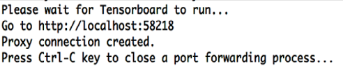

# Launching TensorBoard to View Experiments

You can launch TensorBoard from the the Intel DL Studio Web UI or the CLI. Both methods are described next.

## Launching TensorBoard from the Web UI

**Note:** To view the experiment’s results in TensorBoard, TensorBoard data must be written to a 
folder in the directory `/mnt/output/experiment.`

To launch TensorBoard from the web UI and view results for individual experiments, perform these steps:

1. Open the web ui. **Execute:** `dlsctl launch webui`
2. At the web UI, identify the experiment that you want to see displayed in TensorBoard. Click on the check box to the 
left of the experiment name.
3. With an experiment selected (checked), the **LAUNCH TENSORBOARD** button becomes active. Click **LAUNCH TENSORBOARD**. 
TensorBoard is launched with graphs showing the experiment’s results. 

The following screen displays (this is an example only).

## Launching TensorBoard from the CLI

To launch TensorBoard from the CLI, do the following.

**Execute:** `dlsctl launch tb <experiment_name>`

The following result displays.

This command will launch a local browser. If the command was run with the --no-launch option, then you need to copy the returned URL into a web browser. TensorBoard is launched with graphs showing the experiment’s results (as shown above).
