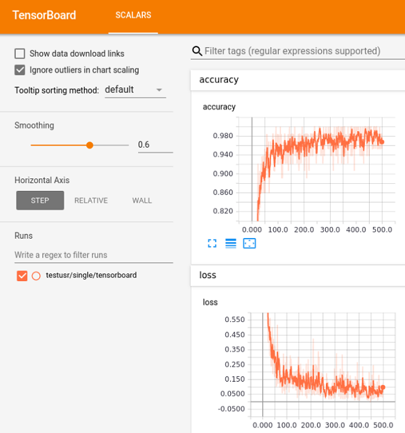

# Launching TensorBoard to View Experiments

You can launch TensorBoard from the Nauta web UI or the CLI; both methods are described. This section discusses the following main topics:

 - [Launching TensorBoard from the Web UI](#launching-tensorboard-from-the-web-ui)
 - [Launching TensorBoard from the CLI](#launching-tensorboard-from-the-cli)  

## Launching TensorBoard from the Web UI

To view the experiment’s results in TensorBoard, TensorBoard data _must be_ written to a 
folder in the directory `/mnt/output/experiment.`

To launch TensorBoard from the web UI and view results for individual experiments, execute these steps:

1. Open the web UI by executing this command:

   `nctl launch webui`

2. At the web UI, identify the experiment that you want to see displayed in TensorBoard. Click the check box to the 
left of the experiment name.

3. With an experiment selected (checked), the **LAUNCH TENSORBOARD** button becomes active. Click **LAUNCH TENSORBOARD**. 
TensorBoard launches with graphs showing the experiment’s results. 

The following screen displays (this is an example only).



## Launching TensorBoard from the CLI

To launch TensorBoard from the CLI, execute this command:

`nctl launch tb <experiment-name>`

The following result displays.

```
Please wait for Tensorboard to run... 
Go to http://localhost: 58218
Proxy connection created.
Press Ctrl-C key to close a port forwarding process...
```

This command will launch a local browser. If the command was run with the `--no-launch` option, then you need to copy the returned URL into a web browser. TensorBoard is launched with graphs showing the experiment’s results (as shown above).

You can also launch TensorBoard and with the `nctl experiment view` command:

`nctl experiment view --tensorboard <experiment-name>`

**Note:** This command exposes a TensorBoard instance with data from the named experiment shown above.

# MNIST Example

You can try out TensorBoard with MNIST classifier `mnist_tensorboard.py` from Python examples in the `examples` folder. Run:

```
nctl experiment submit -p cpu 1 -p memory 8Gi examples/mnist_tensorboard.py -n tb-example
nctl exp view -tb tb-example
```
**Note:** `mnist_tensorboard.py` requires at least 8Gi of memory.

----------------------

## Return to Start of Document

* [README](../README.md)
----------------------
