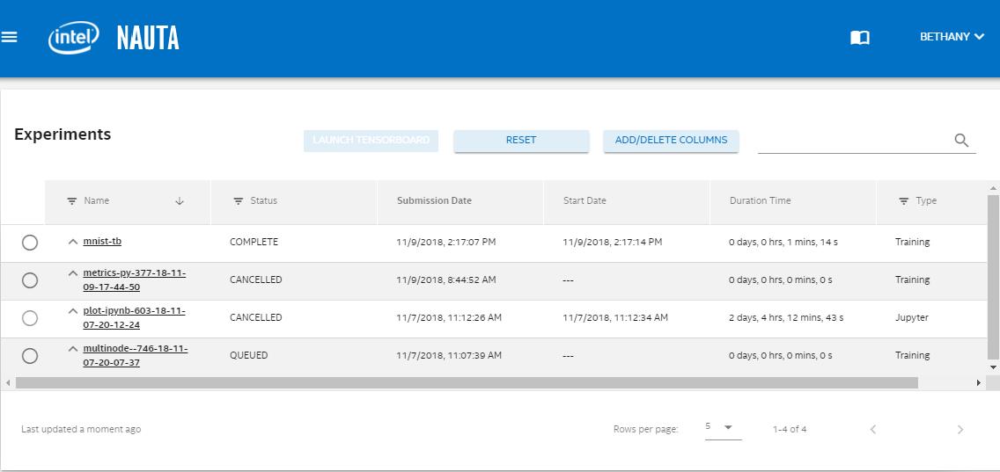
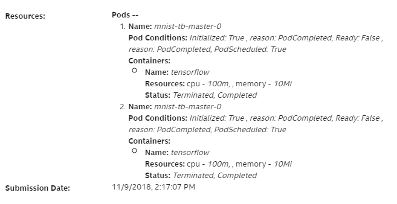
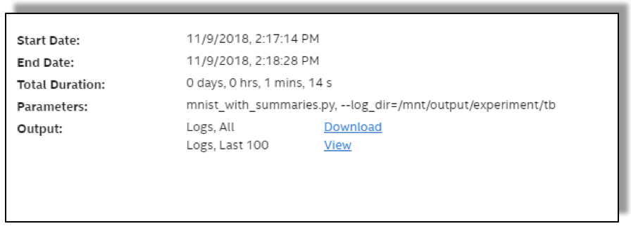

# Viewing Experiment Results from the Web UI

This section discusses the following main topics: 

 - [Viewing Experiment Results at the Web UI ](#viewing-experiment-results-at-the-web-ui)
 - [Expanding Experiment Details](#expanding-experiment-details)
 - [Searching on Experiments](#searching-on-experiments)
 - [Adding and Deleting Columns](#adding-and-deleting-columns)

## Viewing Experiment Results at the Web UI 

The web UI lets you explore the experiments you have submitted. To view your experiments contained in the web UI, execute the following command at the command prompt:

`nctl launch webui`

The following screen displays (this is an example only).

 

**Note:** If you are using CLI through remote access, you will need to setup a X server for tunneling over SSH with port forwarding or use SSH Proxy command tunneling. After establishing a tunnel from the gateway to your local machine, you can use the URL provided by nctl command. The figure shows an example Web UI screen.

### Web UI Columns

* **Name:** The left-most column lists the experiments by name.
* **Status:** This column reveals experiment’s current status, one of: `QUEUED, RUNNING, COMPLETE, CANCELLED, FAILED, CREATING`.
* **Submission Date:** This column gives the submission date in the format: MM/DD/YYYY, hour:min:second AM/PM.
* **Start Date**: This column shows the experiment start date in the format: MM/DD/YYYY, hour:min:second AM/PM. The Start Date (or time) will always be after the Submission Date (or time).
* **Duration:** This column shows the duration of execution for this experiment in days, hours, minutes and seconds.
* **Type:** Experiment Type can be Training, Jupyter, or Inference. Training indicates that the experiment was launched from the CLI. Jupyter indicates that the experiment was launched using Jupyter Notebook. 

**Note:** You can perform the tasks discussed below in the Nauta web UI.

## Expanding Experiment Details

Click _listed experiment name_ to see additional details for that experiment. The following details are examples only. 

This screen is divided into left and right-side frames.  

### Left-side Frame

The left-side frame of the experiment details window shows Resources and Submission Date (as shown in the figure below).

* **Resources** assigned to that experiment, specifically the assigned pods and their status and container information including the CPU and memory resources assigned.

* Displays the **Submission Date** and time.

 
 ## Right-side Frame

The right-side frame of the experiment details window shows Start Date, End Date, Total Duration, Parameters, and Output (as shown in the figure below). 

* **Start Date:** The day and time this experiment was launched. 
* **End date:** The day and time this experiment was launched. 
*	**Total Duration:** The actual duration this experiment was instantiated.
*	**Parameters:** The experiment script file name and the log directory.
* **Output:** Clickable links to download all logs and view the last 100 log entries.

## Searching on Experiments

In the **Search** field at the far right of the UI , enter a string of alphanumeric characters to match the experiment name or other parameters (such as user), and list only those matching experiments. This Search function lets the you search the fields in the entire list, _not_ just the experiment's name or parameters. 

## Adding and Deleting Columns

### ADD/DELETE COLUMNS Button

Click **ADD/DELETE COLUMNS** button to open a dialogue. The columns currently in use are listed first with 
their check box checked. Scroll down to see more, available columns listed next, unchecked. 

### Check/Uncheck Column Headings

Click to check and uncheck and select the column headings you prefer. Optional column headings include parameters, such as Pods, End Date, Owner, Template, Time in Queue, and so on.

### Column Heading Metrics

Column headings also include metrics that have been setup using the Metrics API, for a given experiment, and you 
can select to show those metrics in this display as well.

### Column Additions and Deletions

Column additions and deletions you make are retained between logins. Refer to [Launching TensorBoard to View Experiments](/docs/user-guide/actions/view_exp_tensorbd.md) for more information.

## Launching Kubernetes Dashboard

1. Click the **Hamburger Menu**  at the far left of the UI to open a left frame. 

1. Click **Resources Dashboard** to open the Kubernetes resources dashboard. 

**Note:** Refer to [Accessing the Kubernetes Resource Dashboard](accessing_kubernetes.md) for more information.

----------------------

## Return to Start of Document

* [README](../README.md)
----------------------
