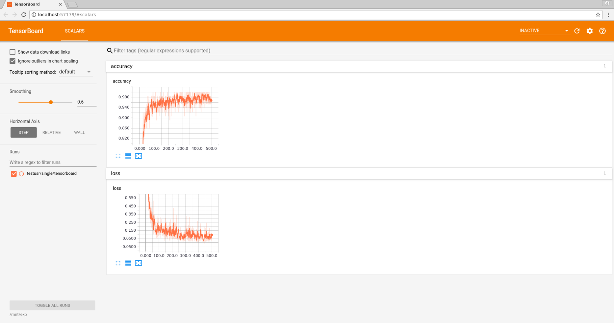

# Introduction

There are example MNIST related scripts placed in `examples` subdirectory of dlsctl installation folder. These scripts
are meant to demonstrate how you can work with DL Studio. Their usage will be described in this document.

## `examples` directory content

We've prepared 3 different training scripts:
1. `mnist_single_node.py` - training of digit classifier in single node setting
1. `mnist_multinode.py` - training of digit classifier in distributed TensorFlow setting
1. `mnist_horovod.py` - training of digit classifier in Horovod

There are also 2 utility scripts: `mnist_converter_pb.py` and `mnist_checker.py` which are related to inference process
and model verification.

# Training

## Launching training

Launching training in DL Studio is in its core very similar between different kinds of trainings. You basically have to
run:

`dlsctl experiment submit -t TEMPLATE_NAME SCRIPT_PATH`

with:
* `TEMPLATE_NAME` = `tf-training-tfjob` and `SCRIPT_PATH` = `examples/mnist_single_node.py` (relative to dlsctl
location) for single node training. Template parameter in this case is optional.
* or `TEMPLATE_NAME` = `multinode-tf-training-tfjob` and `SCRIPT_PATH` = `examples/mnist_multinode.py` for multinode
training
* or `TEMPLATE_NAME` = `multinode-tf-training-horovod` and `SCRIPT_PATH` = `examples/mnist_horovod.py` for Horovod
training

**NOTE:** Example scripts do not require external data source. They download MNIST dataset and save it locally in their
directories.

**NOTE:** Templates referenced here have some set CPU and Memory requirements. Please refer to
[template packs documentation](../actions/template_packs.md) for more info about changing those if you want to.

**NOTE:** For more info about `experiment submit` command please refer to
[`experiment` command documentation](../actions/experiment.md)

For the purposes of this document lets assume that single node training was launched with command:

`dlsctl experiment submit -t tf-training-tfjob examples/mnist_single_node.py --name single`

This command should output:

```
Submitting experiments.
| Experiment   | Parameters           | State   | Message   |
|--------------+----------------------+---------+-----------|
| single       | mnist_single_node.py | QUEUED  |           |
```

We will reference this later in this document.

## Monitoring training

There are 3 ways to monitor training in DL Studio:
* Text logs
* Tensorboard
* Experiment metrics

All 3 ways of monitoring can be used with every out of 3 example scripts.

### Text logs

Everything that a training script outputs with e.g. `print` function or through `logger` is saved in experiment logs.
These can be obtained using:

`dlsctl experiment logs EXPERIMENT_NAME`

**NOTE:** For more info about `experiment logs` command please refer to
[`experiment` command documentation](../actions/experiment.md)

### Tensorboard

Generally every file that the training script outputs to `/mnt/output/experiment` (accessed from the perspective of
training script launched in DL Studio) is easily accessible from the outside after mounting `output` directory with
command provided by `dlsctl mount` (more info about mounting can be found [here](../actions/mount_exp_output.md).
Additionally when training script outputs Tensorflow summaries to this path they can be automatically picked up by
Tensorboard instance launched with command:

`dlsctl launch tensorboard EXPERIMENT_NAME`

Tensorboard instance launched with this command will be automatically accessed through the browser (in default case
without `--no-launch` option).

**NOTE:** For more info about `launch` command please refer to
[`launch` command documentation](../actions/launch.md)

Going back to the `single` experiment launched above, lets see how `launch tensorboard` effect would look like in this
case. Running:

`dlsctl launch tensorboard single`

would give output:

```
Please wait for Tensorboard to run...
Go to http://localhost:57179
Proxy connection created.
Press Ctrl-C key to close a port forwarding process...
```

**NOTE:** Port number may differ in your case because it is randomly chosen.

and show:



### Experiment metrics

Experiments launched in DL Studio can output additional kind of metrics through `publish` function from experiment
metrics api. Too see example of `publish` usage you can look into code of training examples.

To see metrics published by our `single` experiment or any other experiment you can run for example:

`dlsctl experiment list`

In our case this would give output like this (only fragment shown):

```
| Experiment   | Parameters           | Metrics                   |
|--------------+----------------------+---------------------------+
| single       | mnist_single_node.py | accuracy: 1.0             |  ... Table continuation ...
|              |                      | global_step: 499          |
|              |                      | loss: 0.029158149         |
|              |                      | validation_accuracy: 0.98 |
```

# Inference

To perform inference (at least with `predict batch` command) you will have to:
1. Prepare data for model input.
1. Obtain trained model.
1. Run prediction instance with trained model on this data.

## Data preparation

This is where in our example `mnist_converter_pb.py` script can be used. This script prepares sample of MNIST test set
and converts it to protobuf requests acceptable by the served model. This script is run locally and requires
`tensorflow`, `numpy`, and `tensorflow_serving` modules. It has 2 input parameters:
* `--work_dir` which defaults to `/tmp/mnist_test`. It is a path to directory used as workdir by this script and
`mnist_checker.py`. Downloaded MNIST dataset will be stored there as well as converted test set sample and labels
cached for them.
* `--num_tests` which defaults to 100. It is a number of examples from test set which will be converted. Max value is
10000.

Running:

`python examples/mnist_converter_pb.py`

would create `/tmp/mnist_test/conversion_out` directory, fill it with 100 protobuf requests and cache labels for these
requests in `/tmp/mnist_test/labels.npy` file.

## Trained model

Servable models (as other training artifacts) can be saved by training script. As previously mentioned to access these
you have to use command provided by `dlsctl mount` and mount `output` storage locally. Example scripts all save servable
models in their `models` subdirectory. To use model like this for inference you will have to mount `input` storage too,
because models have to be accessible from inside of the cluster. In our example with `single` experiment this process
could look like this:

```
mkdir /mnt/input
mkdir /mnt/input/single
mkdir /mnt/output
... mount command provided with dlsctl mount used to mount output storage to /mnt/output
... mount command provided with dlsctl mount used to mount input storage to /mnt/input
cp /mnt/output/single/models/* -Rf /mnt/input/single/
```

After these steps `/mnt/input/single` should contain:

```
/mnt/input/single/:
00001

/mnt/input/single/00001:
saved_model.pb  variables

/mnt/input/single/00001/variables:
variables.data-00000-of-00001  variables.index
```

## Running prediction instance

This step in DL Studio can be done with for example `predict batch` command. Before we will use this command we have to
copy protobuf requests to `input` storage as they need to be accessed by the prediction instance too. This can be done
in our `single` experiment example with:

```
mkdir /mnt/input/data
cp /tmp/mnist_test/conversion_out/* /mnt/input/data
```

Now to run prediction instance you can use:

`dlsctl predict batch -m /mnt/input/home/single -d /mnt/input/home/data --model-name mnist --name single-predict`

**NOTE:** Notice additional `home` directory in path to both model and input data. This is how the path looks from the
perspective of the prediction instance.

**NOTE:** `mnist_converter_pb.py` creates requests to `mnist` model. `--model-name mnist` is where this `mnist` name is
given to the prediction instance.

**NOTE:** For more info about `predict` command please refer to
[`predict` command documentation](../actions/predict.md)

This command should output:

```
| Prediction instance   | Model location         | State   |
|-----------------------+------------------------+---------|
| single-predict        | /mnt/input/home/single | QUEUED  |
```

After the prediction instance completes (can be checked with `predict list`) you can collect instance responses from
`output` storage. In our example it would contain 100 protobuf responses. These can be validated in our case using
`mnist_checker.py`. Simply running locally:

`python examples/mnist_checker.py --input_dir /mnt/output/single-predict`

would display error rate calculated for this model and this sample of test set.