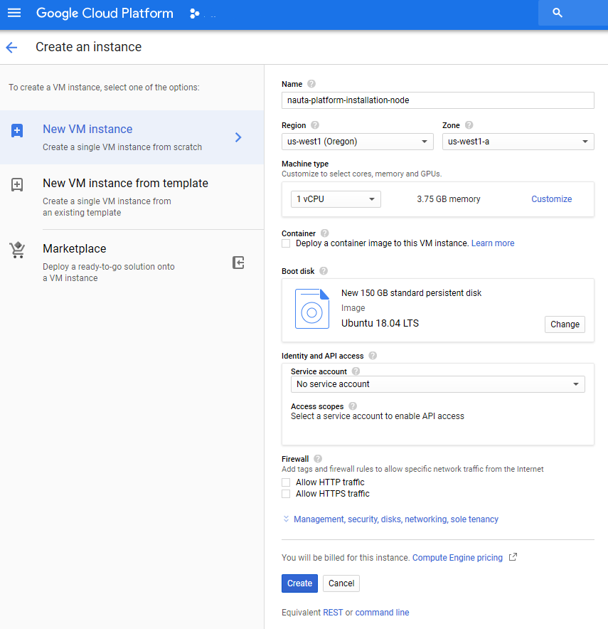
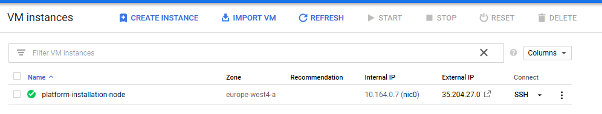

# Nauta on Google Cloud Platform - Getting Started

Nauta platform has many different deployment options and customization capabilities. In order to make it simple for a typical use case, this guide uses simplified deployment procedure and relays on default parameters.

If you prefer to use local machines, adjust advanced options or cluster details, please refer to the [Advanced Nauta Installation Guide](gcp-advanced.md).

## Introduction

This guide assumes that installation will proceed on a dedicated node, created on Google Cloud Platform - we'll name it the Platform Installation Node.

Most of the steps involved are being executed on this machine.

Please note that the platform will be compiled from the source code during this procedure - it may take some time; typical installation time takes around 2 hours - please be patient. Binary installation is described in advanced guide.

### Google Cloud Platform Console: Create Platform Installation Node instance

In order to install platform, you will need a machine created on Google Cloud Platform, using it's web interface, Google Cloud Platform Console.
 
Please create machine with the following specification:
- Machine type: at least 1 vCPU, 3.75 GB memory (this machine can be very small)
- Boot disk: Ubuntu 18.04 LTS with 150 GB standard disk
- Other options can stay in their default state.

Please note that you need to have remote access configured to be able to remotely access this machine over SSH; this is out of scope of this tutorial - please contact your administrator or Google Cloud Platform documentation for support.



### Platform Installation Node: Login via SSH

Platform Installation Node details, including its external IP address and in-browser connectivity, can be found on the instances list in the Google Cloud Platform Console:



Use either in-browser connectivity (by clicking "SSH" option) or your own SSH client - with external IP address listed (keep in mind that you may need to configure proxy in order to access it).

### Platform Installation Node: Install required packages

```
sudo apt update && sudo apt install git make python3-pip python3-dev virtualenv unzip
echo -e "\n\n\n" | ssh-keygen -t rsa -N ""
```

Please note that the SSH keys generated during this step will be used for the initial login to the platform after deployment.

### Platform Installation Node: Clone Nauta repository

```
git clone https://github.com/IntelAI/nauta
cd nauta
echo 'export NAUTA_DIR=$HOME/nauta' >> ~/.bashrc
source ~/.bashrc
```

***From this point on, all operations described below should be made on Platform Installation Node. All paths are connected with cloned repository*** 

### Google Cloud Platform Console - Create Service Account

Nauta deployment requires a subset of Google Cloud Platform permissions; those are represented by Service Account resource.

In order to create create dedicated service account for Nauta deployment needs, please follow the official Google Cloud Platform guide available here: https://cloud.google.com/iam/docs/creating-managing-service-accounts

Please note that the service account has to be created to operate on user's project dedicated to running Nauta cluster (please refer to https://console.cloud.google.com/iam-admin/serviceaccounts?project=<project_name>).

Service account should have `project-owner` priviliges and be ready to create gke cluster, vpc, virtual machines.

With the service account created, you will be able to download a JSON file with its details - please save it, data within is required in the next step.

#### Platform Installation Node: adjust Google Cloud Platform service account config

Copy previously downloaded JSON configuration file (for service account) as `gcp-service-account.json` into `$NAUTA_DIR/toolbox/providers/gcp` directory. 

## Platform Installation Node: Adjust cluster details

```$xslt
gcp:
  region: "us-west1"               # GCP target data center
  zone: "us-west1-a"               # GCP target data center zone
  external_username: "nauta"       # safe default
  internal_username: "nauta"       # safe default
  gateway_type: "n1-standard-4"    # safe default
  testnode_type: "n1-standard-4"   # (do not edit)
  nfs_type: "n1-standard-2"        # safe default
  nfs_disk_size: "400"             # size in GB, safe default
  pool_type: "n1-standard-16"      # Worker GCP Node size, adjust as needed
  pool_size: "1"                   # Number of Worker GCP Nodes
  pool_min_cpu_platform: "Intel Skylake" # CPU Architecture, safe default
  generate_test_node: False        # (do not edit)
  testnode_image: ""               # (do not edit)
``` 

### Platform Installation Node: Deployment: cluster creation

```
cd $NAUTA_DIR/toolbox/providers/gcp/
./gcp.sh --operation create --compile-platform-on-cloud true
```

If you would like to create multiple Nauta deployments on a single account, pass extra parameter `--k8s-cluster NAME` to `gcp.sh`, with different names for every Nauta deployment.

### Platform Installation Node: Post Installation Steps

Cluster creation step will create file containing details of your fresh Nauta cluster and save them in file:

```
cat $NAUTA_DIR/toolbox/providers/gcp/<k8s-cluster>.info
```
where `k8s-cluster` is the name of cluster provided to `--k8s-cluster` flag or `nauta` if the flag wasn't provided.

Next steps is to connect via ssh to the Nauta Cluster Bastion Node using the following command:

```
ssh nauta@<ip-gateway-from-nauta.info>
```

Bastion node is accessible from the Internet. Please adjust authorized keys - add your own to the bastion host to `~/.ssh/authorized_keys`.

When on Nauta Cluster Bastion Node, untar `~/artifacts/nctl-1.0.0-<timestamp>-linux.tar.gz` file which gives you a possibility to use `nctl` tool. Refer to [Nauta Getting Started document](../../../docs/user-guide/actions/getting_started.md) for further information on `nctl`. Your first step after veryfing that `nctl` works correctly should be a regular user creation and switching to it to perform other operations supported by Nauta.  

### Next Steps

When connected via ssh to Nauta Cluster Bastion Node, you can use `nctl` command to manage cluster.

### Platform Installation Node - Cluster Removal

When you need to delete cluster you created, you can issue the following command when being signed in to the Platform Installation Node:

```
cd $NAUTA_DIR/toolbox/providers/gcp/
./gcp.sh --operation destroy
```
